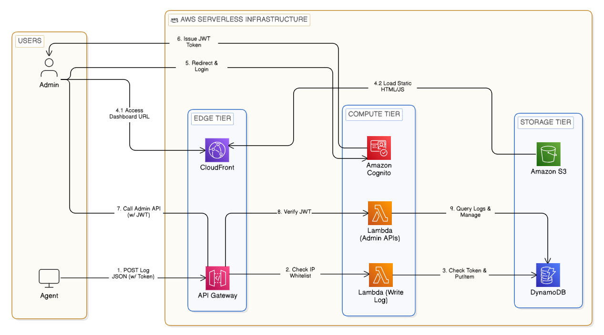

# Serverless Centralized Log Management System

A centralized log management system built on an **AWS Serverless Architecture** for collecting, storing, tracing, and analyzing security logs from distributed systems.

The system collects:
- Linux system logs
- Firewall logs
- Suricata IDS events

Leverages **Amazon API Gateway**, **AWS Lambda**, **Amazon DynamoDB**, **Amazon S3**, **Amazon Cognito**, **AWS IAM**, and **Amazon CloudFront** to provide a scalable and serverless solution that reduces the risk of local log tampering.

## System Architecture

  

> Click the architecture diagram to view it in full size.

## Technologies

- AWS Lambda
- Amazon API Gateway
- Amazon DynamoDB
- Amazon S3
- Amazon Cognito
- AWS IAM
- Amazon CloudFront
- GitHub Actions (CI/CD)
- Python
- Linux

## Documentation

A detailed explanation of the system design, implementation, deployment process, and evaluation is available in the project report:

📄 **[Project Report](./docs/Project_2.pdf)**

---

*This project was developed as part of the Project II course at Hanoi University of Science and Technology (HUST).*
